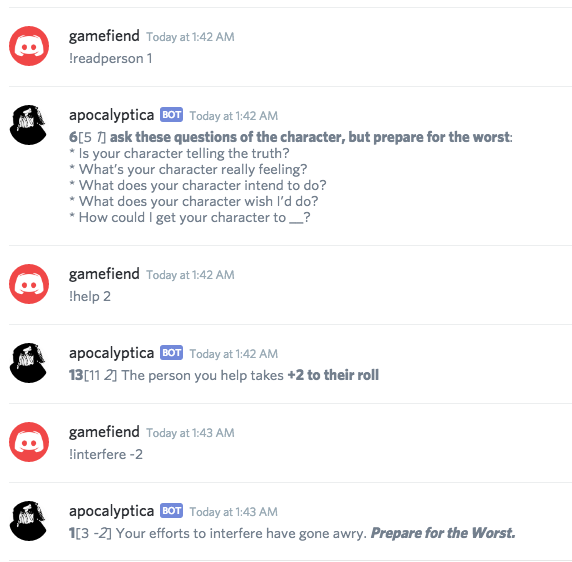

Apocalyptica
---

## An Apocalypse World 2e Discord Bot. 

[Apocalypse World](http://apocalypse-world.com) is a great game by Vincent Baker. This bot makes playing the game online easier by providing a dice-roller that also outputs the details of a hit or miss:



### Usage
```
!moves - display supported moves (only the basic moves are included)
!!help - display usage

!<move> <bonus> - rolls and displays move results.
```


### Use it Now

Want to try an instance of Apocalyptica on your server? [Try it now](https://apocalyptica.social-fiction.net).

### Roll Your Own

If you want to use your own server, you will first need to [register your app](docs/register.md), then look at the [different ways you can deploy](docs/deploying.md) to Apocalyptica.

#### Adding your own moves.  

Add your own moves by adding [your own games and playbooks](docs/game-playbook.md)
