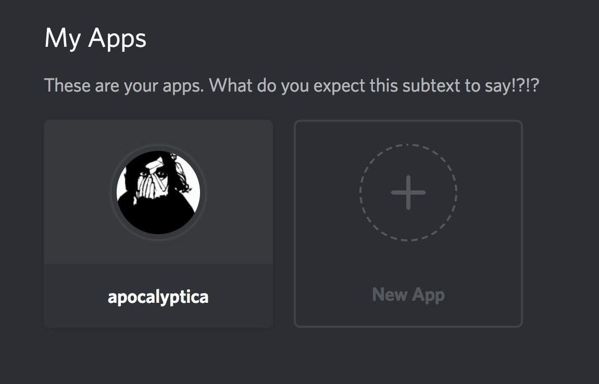
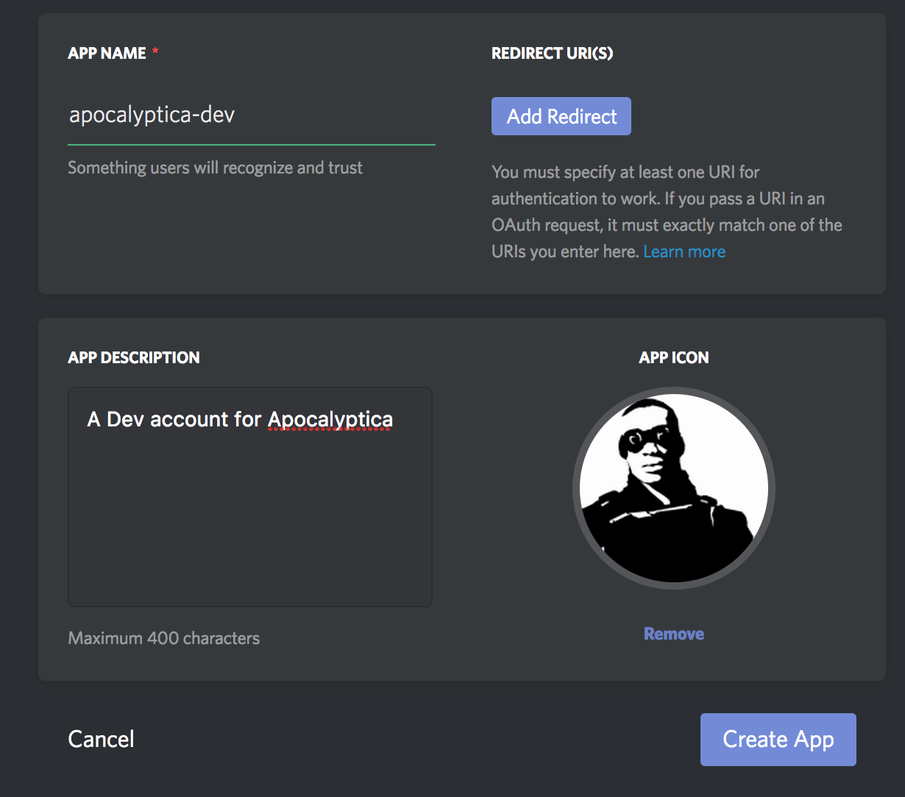
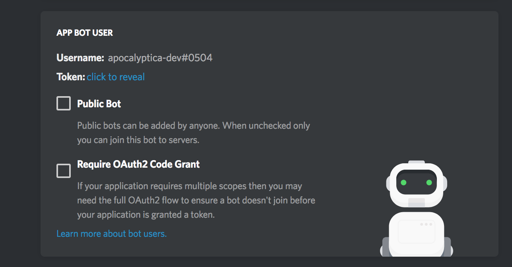
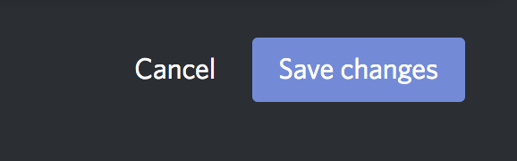
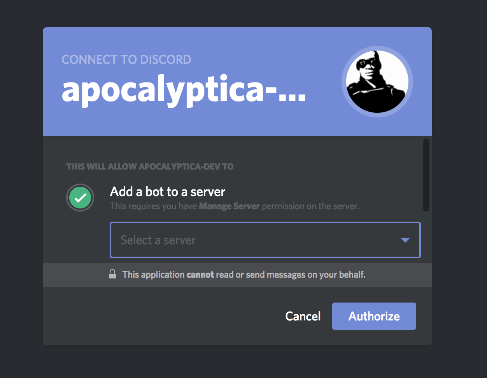

# Registering Apocalyptica
> **IN PROGRESS! DO NOT USE!!!** Still testing out some things.

## Overview

This document covers instructions for registering apps with Discord. Looking for information on how to deploy? Go to ['Deploying Apocalyptica'](deploying.md).

Interested in test driving Apocalyptica before setting up your own? [Go to the Apocalyptica Reference install](https://apocalyptica.social-fiction.net) and invite it to your server.

## Steps to Register Apocalyptica in Discord.

Sign in to Discord and go to the [Developer page, 'My Apps'](https://discordapp.com/developers/applications/me). 

Select 'New App'.

Give your instance of apocalyptica a name, description, and picture.

Select 'Creat a Bot User', then on the following screen:

Click 'click to reveal' and copy the token string. You will want to save this in your `env_discord.sample` file in the variable `DISCORD_TOKEN`.

Above the 'Create a Bot User' information is the client ID of the application. Copy that ID into `env_discord.sample` file in the variable `CLIENT_ID`.

When you have retrieved that information, save the changes.

## Invite Apocalyptica to a Server

Now that you have an app registered, you need to invite it to your server. To do that you need an authorization link.

The authorize link looks like this:
`https://discordapp.com/oauth2/authorize?&client_id=<CLIENTID>&scope=bot&permissions=0`

which will take you to a page like this:

Choose one of your servers from the list, and choose 'Authorize' to invite Apocalyptica to the server!
